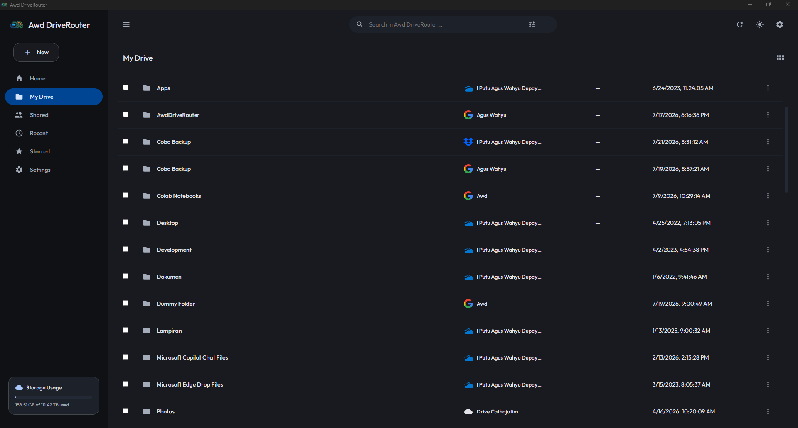
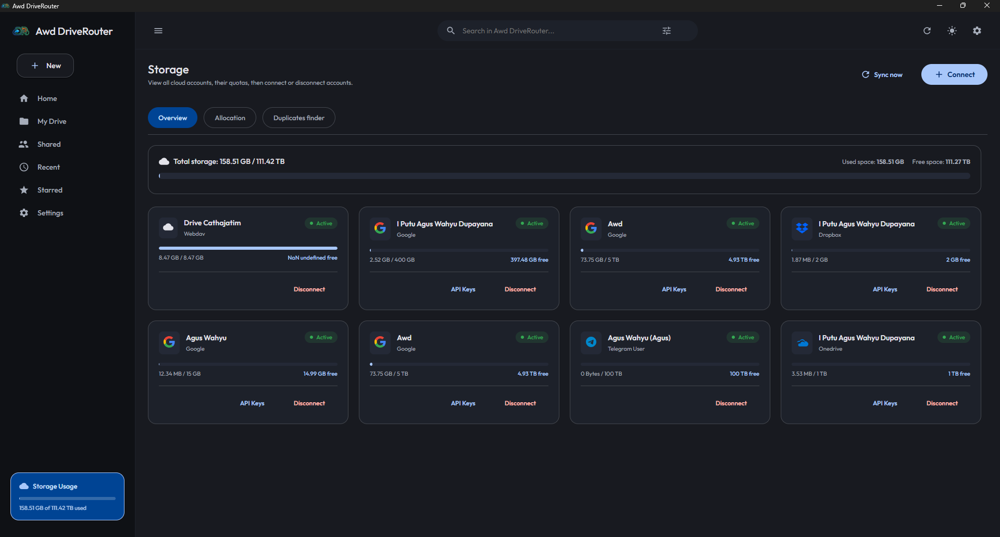
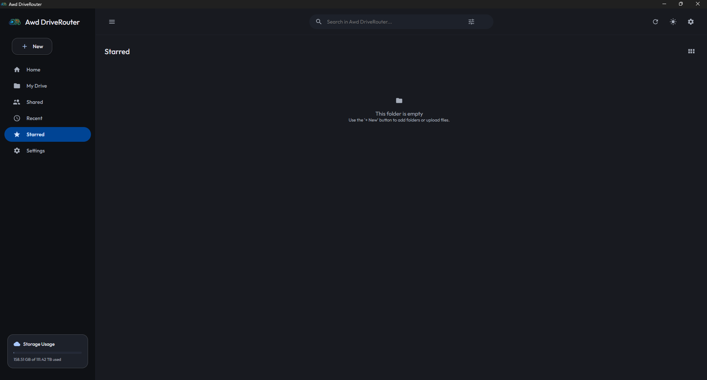
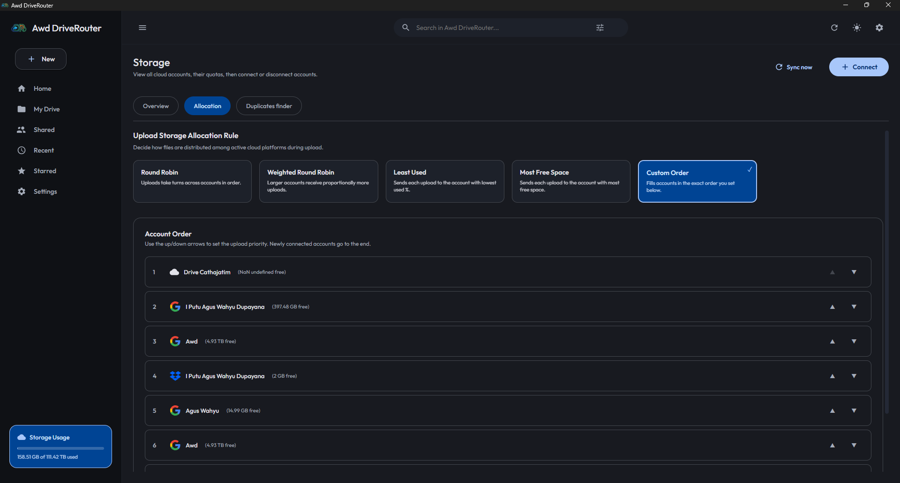
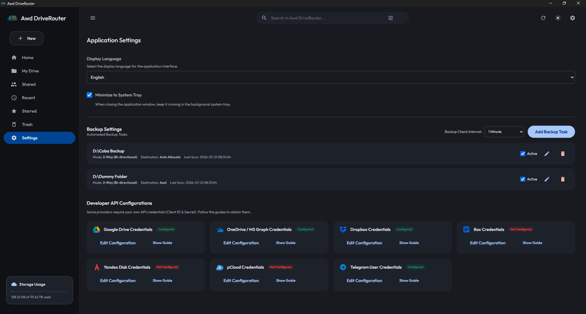
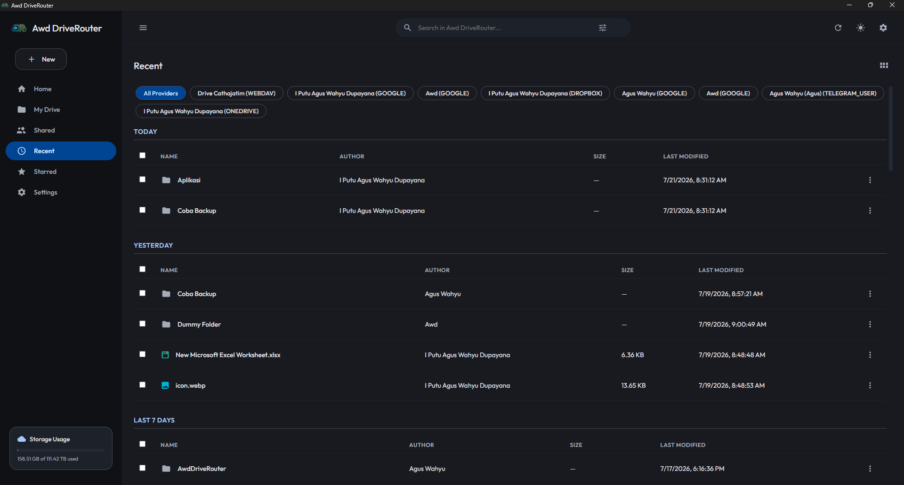

# Awd DriveRouter Desktop 💻☁️🔀

<p align="center">
  
</p>

<p align="center">
  <a href="https://github.com/putuwahyu29/awd-drive-router-desktop/blob/main/LICENSE">
    
  </a>
  
  
  
  
  
</p>

**Awd DriveRouter Desktop** is a powerful, cross-platform desktop application that unifies multiple cloud storage providers into a single, intelligent file management interface. Built with **Wails (Go)** and **React/Vite (TypeScript)**, it acts as a smart routing layer — letting you upload, sync, browse, and share files across Google Drive, OneDrive, Dropbox, Box, Yandex Disk, pCloud, WebDAV, S3-compatible storage, and Telegram — all from one seamless desktop experience.

---

## 🌐 Language / Bahasa
*   [English Version (Main)](README.md)
*   [Versi Bahasa Indonesia](README.id.md)

---

## 📌 Table of Contents
- [✨ Key Features](#-key-features)
- [📷 Screenshots](#-screenshots)
- [☁️ Supported Cloud Providers](#️-supported-cloud-providers)
- [📁 Storage & Paths](#-storage--paths)
- [🚀 Getting Started & User Guide](#-getting-started--user-guide)
  - [Prerequisites](#prerequisites)
  - [Connecting a Cloud Account](#connecting-a-cloud-account)
  - [Upload Strategy](#upload-strategy)
  - [Folder Synchronization & Backup](#folder-synchronization--backup)
  - [Sharing Files](#sharing-files)
  - [Archive & Compression](#archive--compression)
- [🛠️ Developer Guide](#️-developer-guide)
  - [Project Directory Structure](#project-directory-structure)
  - [Running in Development Mode](#running-in-development-mode)
  - [Building for Production](#building-for-production)
- [⚙️ Troubleshooting & Logs](#️-troubleshooting--logs)
- [⚠️ Disclaimer](#️-disclaimer)
- [📄 License](#-license)

---

## ✨ Key Features

*   **🔀 Multi-Cloud Router**: Connect and manage multiple cloud storage accounts simultaneously. DriveRouter intelligently routes file uploads across all configured providers using selectable strategies.
*   **📤 Smart Upload Strategies**: Choose how your files are distributed across providers:
    *   **Round Robin**: Spreads uploads evenly across all active accounts.
    *   **Largest Free Space**: Always uploads to the account with the most available storage.
*   **🔄 Folder Synchronization & Automated Backup**: Set up sync tasks that link local folders to any connected cloud account.
    *   **Upload-Only Sync**: Safely mirror local folders to the cloud without touching existing remote files.
    *   **Two-Way Sync**: Keeps both local and remote folders in perfect parity, reflecting additions and deletions bidirectionally.
    *   **Configurable Backup Intervals**: Background backup runs automatically at user-defined intervals.
*   **📦 Archive & Compression**: Select multiple files and compress them into a `.zip` archive on the fly. The resulting archive is automatically uploaded to your chosen cloud destination.
*   **🔗 File Sharing**: Generate and retrieve direct web URLs for files hosted on connected providers for easy sharing.
*   **🔒 Encrypted Token Storage**: OAuth tokens and sensitive credentials are encrypted at rest using the built-in security layer — never stored as plain text.
*   **📊 Storage Allocation View**: Visualize storage usage and quota across all connected accounts in one unified dashboard.
*   **⭐ Starred Files**: Star frequently accessed files and access them quickly from the Starred view.
*   **🕒 Recent Files**: Instantly view the 30 most recently modified files across all connected providers.
*   **📡 Real-time Upload Progress**: A dedicated WebSocket server streams live upload progress directly to the frontend.
*   **⚙️ Native Windows Integration**: System tray support, minimize-to-tray on close, and configurable startup behavior.
*   **🌐 Multi-Language Support**: Fully localized English and Bahasa Indonesia interface.

---

## 📷 Screenshots

| | |
|:---:|:---:|
| <br/>**Main Dashboard / File Manager** | <br/>**Storage Usage Analytics** |
| <br/>**Starred File** | <br/>**Storage Allocation View** |
| <br/>**Settings, Backup & Provider Configuration** | <br/>**Recent Files** |

---

## ☁️ Supported Cloud Providers

| Provider | Connection Type | Notes |
| :--- | :---: | :--- |
| **Google Drive** | OAuth 2.0 | Requires OAuth client ID & secret from Google Cloud Console |
| **OneDrive** | OAuth 2.0 | Uses Microsoft Entra (Azure AD) app registration |
| **Dropbox** | OAuth 2.0 | Requires Dropbox app key & secret |
| **Box** | OAuth 2.0 | Requires Box OAuth 2.0 app credentials |
| **Yandex Disk** | OAuth 2.0 | Requires Yandex OAuth application credentials |
| **pCloud** | Direct Login | Email & password — no OAuth app required |
| **WebDAV** | Direct Login | Server URL, username, and password or app token |
| **S3-Compatible** | Access Keys | Endpoint, bucket, access key ID, and secret key |
| **Telegram Bot** | Bot Token | Bot token + target chat/channel ID |
| **Telegram User** | MTProto | Phone number, API ID, API hash — via `my.telegram.org` |

> [!NOTE]
> For OAuth providers (Google Drive, OneDrive, Dropbox, Box, Yandex Disk), you must configure the following redirect URI in your provider's developer console:
> `http://localhost:5998/oauth/callback`
>
> For detailed per-provider setup instructions, see [docs/provider-setup.md](docs/provider-setup.md).

---

## 📁 Storage & Paths

All configuration, metadata, and session data are stored in the platform-specific user configuration directory (resolved via `os.UserConfigDir()` — `%APPDATA%` on Windows, `~/.config` on Linux, `~/Library/Application Support` on macOS):

*   **Application Database**: `<UserConfigDir>/driverouter/driverouter.db` — SQLite database holding all file records, account credentials (encrypted), sync tasks, and settings.
*   **OAuth Callback Server**: Runs locally at `http://localhost:5998/oauth/callback` during authentication flows.
*   **Upload WebSocket Server**: A local WebSocket server streams real-time upload progress to the frontend UI.

---

## 🚀 Getting Started & User Guide

### Prerequisites
To run the pre-built application, simply double-click the `Awd-DriveRouter.exe` executable. No additional runtime drivers are required beyond Windows WebView2 (included by default on Windows 10/11).

### Connecting a Cloud Account
1. Open the application and navigate to **Cloud Accounts** (or **Settings** for OAuth providers).
2. For OAuth providers (Google Drive, OneDrive, Dropbox, Box, Yandex Disk):
   - First, configure your OAuth credentials in **Settings** under the respective provider section.
   - Then open **Cloud Accounts** and click **Connect** for the desired provider.
   - A browser window will open for authentication. After login, the app automatically captures the OAuth token via the local callback server.
3. For direct-login providers (pCloud, WebDAV, S3, Telegram):
   - Open **Cloud Accounts** → **Connect** → select the provider.
   - Fill in the required credentials and submit.

> [!IMPORTANT]
> OAuth tokens are encrypted at rest. However, keep your `api_id`, `api_hash`, and OAuth client secrets private and never share your application database file.

### Upload Strategy
Configure how DriveRouter distributes uploads in **Settings → Upload Strategy**:
- **Round Robin** *(default)*: Each new upload is sent to the next account in rotation, spreading data evenly.
- **Largest Free Space**: Each upload is routed to the account that currently has the most available quota.

### Folder Synchronization & Backup
1. Go to the **Backup / Sync** tab.
2. Click **Add Task** and select a local folder using the folder picker dialog.
3. Choose the target cloud account and a destination folder within that account.
4. Select the sync mode:
   - **Upload-Only**: Local changes are mirrored to the cloud (safe, one-directional).
   - **Two-Way Sync**: Additions and deletions are reflected on both sides.
5. Set the backup interval in **Settings → Backup Interval** (default: 60 seconds).
6. Enable the task. The background service runs automatically at the configured interval.

### Sharing Files
1. Right-click or use the action menu on any file in the File Manager.
2. Select **Open Web URL** or **Share**.
3. The app retrieves and opens the provider's native web URL for that file.

### Archive & Compression
1. Select multiple files in the File Manager using checkboxes.
2. Click **Compress to ZIP**.
3. Enter an archive name. The app downloads all selected files, packages them into a `.zip`, and uploads the archive to your target destination automatically.

### Telegram User Connection
1. Go to **Cloud Accounts** → **Connect** → **Telegram User**.
2. Enter your phone number, Telegram API ID, and API hash (obtained from [my.telegram.org](https://my.telegram.org)).
3. Enter the OTP code sent to your Telegram account.
4. If Two-Step Verification is enabled, enter your 2FA password.

---

## 🛠️ Developer Guide

### Project Directory Structure
```
awd-drive-router-desktop/
├── app.go                  # Main Wails application lifecycle, startup, and shutdown
├── app_accounts.go         # Cloud account management, OAuth flows, and settings API
├── app_archive.go          # ZIP compression and multi-file archive upload logic
├── app_backup.go           # Folder sync task management and background backup service
├── app_files.go            # Virtual file system: browse, upload, download, delete
├── app_preview.go          # File preview helpers and media type detection
├── app_sharing.go          # File sharing and remote web URL resolution
├── app_transfer.go         # Core upload/download transfer orchestration
├── main.go                 # Go application entry point
├── shared_view.go          # Shared file/folder view helpers
├── tray.go                 # Windows system tray integration (Windows-only build)
├── tray_other.go           # No-op tray stub for non-Windows platforms
├── upload_ws.go            # WebSocket server for real-time upload progress
├── backend/
│   ├── db/                 # SQLite database layer (accounts, files, sync tasks, settings)
│   ├── provider/           # Provider client implementations (Drive, OneDrive, S3, etc.)
│   ├── router/             # Upload routing logic (round-robin, largest-free-space)
│   ├── security/           # Token encryption and decryption utilities
│   └── sync/               # Sync engine: diff computation and two-way sync execution
├── docs/
│   └── provider-setup.md   # Detailed per-provider OAuth setup guide
├── go.mod                  # Go module dependencies
├── go.sum                  # Go module checksums
├── logo.png                # Application logo
├── wails.json              # Wails project configuration
├── build/                  # Wails build assets and output binaries
└── frontend/               # React + Vite + TypeScript frontend application
```

### Running in Development Mode
To run the project locally with live-reloading:

1. **Install dependencies**:
   Make sure you have [Go](https://go.dev) (1.25+), [Node.js](https://nodejs.org), and [Wails CLI](https://wails.io/docs/gettingstarted/installation) installed.
   ```bash
   # Install Wails CLI if you haven't already
   go install github.com/wailsapp/wails/v2/cmd/wails@latest
   ```
2. **Start Dev Server**:
   ```bash
   wails dev
   ```
   The application will launch with hot-reload enabled. The Go dev server is also accessible at `http://localhost:34115` for browser-based testing.

### Building for Production
Awd DriveRouter Desktop is fully cross-platform and can be compiled for Windows, macOS, and Linux.

#### 1. Mapped Output Binaries
*   **Windows**: `build/bin/Awd-DriveRouter.exe`
*   **macOS**: `build/bin/Awd-DriveRouter.app` (App Bundle)
*   **Linux**: `build/bin/Awd-DriveRouter`

#### 2. Compiling for Production
Compile an optimized, clean production binary for the current OS:
```bash
wails build -clean -ldflags "-s -w"
```

#### 3. Cross-Platform Compilation
```bash
# Build for Windows
wails build -platform windows/amd64

# Build for macOS (Darwin Universal/Intel/Apple Silicon)
wails build -platform darwin/universal

# Build for Linux
wails build -platform linux/amd64
```

#### 4. Generating Installer / Setup Files
*   **Windows Setup Installer (NSIS)**:
    Requires [NSIS](https://nsis.sourceforge.io/) installed on your Windows path. Run:
    ```bash
    wails build -nsis
    ```
    This generates a single setup installer executable `build/bin/Awd-DriveRouter-amd64-installer.exe`.

---

## ⚙️ Troubleshooting & Logs

*   **WebView Errors**: Ensure your Windows has the WebView2 runtime installed (included by default on Windows 10/11).
*   **OAuth Callback Fails**: Verify that the redirect URI `http://localhost:5998/oauth/callback` exactly matches the URI configured in your provider's developer console.
*   **Missing Credentials Error**: If a provider shows "credentials not configured", open **Settings** and ensure the client ID and client secret for that provider are saved before connecting.
*   **Sync Task Not Running**: Confirm the task is enabled in the **Backup / Sync** tab and that the local folder path still exists.
*   **Token Expired / Re-authentication Required**: Disconnect and reconnect the affected account from **Cloud Accounts**.
*   **Reset Application State**: To fully reset the app (delete all accounts, settings, and file records), delete the `%APPDATA%\driverouter\` directory on Windows.

---

## ⚠️ Disclaimer

This project is an independent open-source development created solely for educational and personal productivity purposes. It is not affiliated, associated, authorized, or endorsed by Google, Microsoft, Dropbox, Box, Yandex, pCloud, Telegram, Amazon Web Services, or any other service provider whose APIs are integrated.

Users are solely responsible for ensuring their usage complies with each provider's Terms of Service and any applicable local or international laws. The developers assume no liability for misuse, data loss, service interruptions, policy violations, or any other consequences resulting from the use of this software.

---

## 📄 License

This project is licensed under the MIT License. See the [LICENSE](LICENSE) file for the full license text.

---

<p align="center">Made with ❤️ by <a href="mailto:aguswahyu@office.awd.my.id">I Putu Agus Wahyu Dupayana</a></p>
